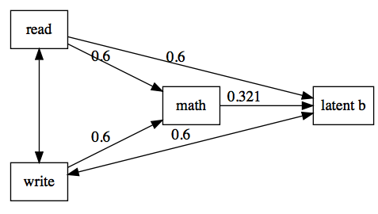

# diagram : Graphviz and DOT Path Diagrams in Stata

__`diagram`__ generates dynamic diagrams using 
[DOT markup language](http://en.wikipedia.org/wiki/Dot)  
and exports images in __pdf__, __png__, __jpeg__, __gif__, and __bmp__ format. For 
more information [visit diagram homepage](http://www.haghish.com/dot). It can also generate diagrams automatically from Stata data set. 

        
Author
------
  **E. F. Haghish**  
  Center for Medical Biometry and Medical Informatics    
  University of Freiburg, Germany        
  _haghish@imbi.uni-freiburg.de_       
  _http://www.haghish.com/dot_      
  _[@Haghish](https://twitter.com/Haghish)_      
  
Installation
------------

__`diagram`__ package relies on __`webimage`__ package for exporting the graphs to various formats. For more information regarding the latter package, visit [__webimage__ on GitHub](https://github.com/haghish/webimage). Both packages are installable via GitHub. 

<!--
The __diagram__ releases are also hosted on SSC server. So you can download the latest release as follows:

    ssc install diagram   //NOT YET RELEASED ON SSC
    ssc install webimage  //NOT YET RELEASED ON SSC               

You can also directly download __diagram__ from GitHub which includes the latest beta version (unreleased). -->
To install from GitHub, the `force` 
option ensures that you _reinstall_ the package, even if the release date is not yet changed. The release date only is changed for new releases and not for the current development.  
  
    net install diagram,  force  from("https://raw.githubusercontent.com/haghish/diagram/master/")
    net install webimage, force  from("https://raw.githubusercontent.com/haghish/webimage/master/")
    
For exporting graphical files, the  [__webimage__](https://github.com/haghish/webimage) package requires [phantomJS](http://phantomjs.org/download.html), 
which is an open-source freeware available for Windows, Mac, and Linux. The 
path to the executable [phantomJS](http://phantomjs.org/download.html) file is required in order to export the graphical files. However, if the executable file is installed in the default local 
directory (e.g. `/usr/local/bin/` in Mac), the `phantomjs(str)` can be ignored. 

Examples
------------

The __examples__ directory includes several examples for generating dynamic diagrams from `DOT` markup and Stata data sets. 

Example 1
---------

In the `examples` directory, there is a DOT file named `PATH1.txt` which draws a path diagram. The file is rendered by `diagram` command and exported to a PNG file directly from Stata:

    diagram using "./examples/PATH1.txt", export(./examples/example1.png)
	

